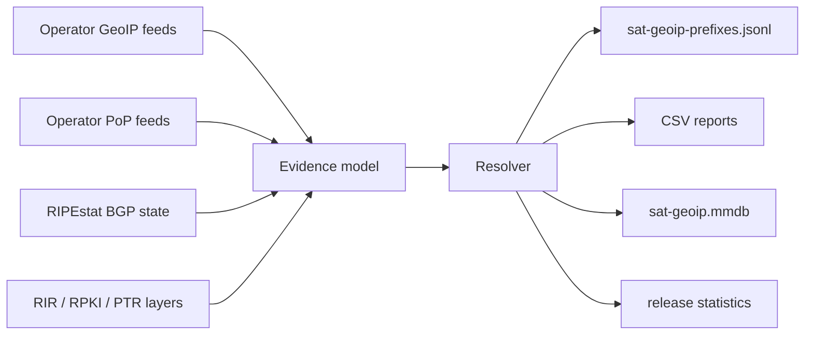

# sat-geoip

<p align="center">
  
</p>

<p align="center">
  <a href="./LICENSE"></a>
  <a href="https://github.com/ipanalytics/Sat-geoip/actions/workflows/dataset-release.yml"></a>
  <a href="https://github.com/ipanalytics/Sat-geoip/releases"></a>
  
  
</p>

https://ipanalytics.github.io/Sat-geoip/

sat-geoip builds a satellite-internet intelligence dataset from operator GeoIP feeds, subnet-to-PoP mappings, live BGP announcements, RIR/RPKI ownership evidence, and historical snapshots. It emits CSV, JSONL, and MaxMind DB artifacts that keep geolocation, PoP assignment, PTR observations, and routing state as separate evidence layers.

---

## Links

| Resource | Location |
|---|---|
| Interactive dashboard | [GitHub Pages](https://ipanalytics.github.io/Sat-geoip/) |
| Latest dataset release | [GitHub Releases](https://github.com/ipanalytics/Sat-geoip/releases) |
| Generated artifacts | [`outputs/`](./outputs) |
| Operator registry | [`config/operators.yaml`](./config/operators.yaml) |
| Example evidence | [`examples/acceptance_evidence.json`](./examples/acceptance_evidence.json) |

## Overview

Satellite networks do not map cleanly to conventional GeoIP assumptions. A customer subnet, a declared PoP, a reverse DNS hint, and a BGP origin are different facts with different failure modes. sat-geoip preserves those facts as separate fields and records the quality signals that connect or contradict them.

The pipeline is designed for data-engineering and infrastructure workflows:

- ingest operator-published geofeeds and PoP maps;
- correlate them with live BGP origin state;
- retain explicit semantics for every derived field;
- generate stable machine-readable artifacts for enrichment, routing analytics, and infrastructure inventories.

## Architecture



The resolver applies fixed precedence rules:

| Field | Winning source | Notes |
|---|---|---|
| Operator | live BGP origin, then RIR org match | ASNs are treated as a discovered set |
| GeoIP | operator geofeed | customer-subnet location semantics |
| PoP | official PoP feed | PTR is corroboration only |
| Routing state | BGP collectors | geofeeds do not imply live routing |
| Ground station claim | constant `false` | never inferred from GeoIP or PoP data |

## Current Dataset

<!-- SAT_GEOIP_STATS_START -->
| Dataset metric | Count |
|---|---:|
| Prefixes | 11231 |
| Announced prefixes | 7887 |
| GeoFeed-only prefixes | 3344 |
| BGP-only prefixes | 6957 |
| Prefixes with PoP assignment | 3291 |
| Ground station claims | 0 |

### Operators

| Name | Count |
|---|---:|
| `avanti` | 23 |
| `eutelsat_skylogic` | 274 |
| `hughes` | 675 |
| `inmarsat` | 55 |
| `intelsat` | 91 |
| `marlink` | 29 |
| `oneweb` | 17 |
| `ses_o3b` | 22 |
| `speedcast` | 106 |
| `starlink` | 5406 |
| `thuraya` | 10 |
| `viasat` | 4523 |

### Orbit Classes

| Name | Count |
|---|---:|
| `geo` | 698 |
| `geo_mss` | 10 |
| `geo_or_hybrid_satellite` | 4852 |
| `geo_or_multi_orbit` | 91 |
| `leo` | 5423 |
| `meo` | 22 |
| `mixed_satellite` | 135 |
<!-- SAT_GEOIP_STATS_END -->

The checked-in `outputs/` directory is generated from live public feeds. The example evidence fixture remains in the repository to exercise acceptance cases and deterministic tests.

## Operator Coverage

| Operator | Orbit | Service class | Evidence layers | GeoFeed |
|---|---|---|---|---|
| Starlink | LEO | `satellite_internet` | GeoIP feed, PoP feed, BGP, RIR/RPKI model | active |
| Eutelsat OneWeb | LEO | `satellite_internet` | BGP, PeeringDB/RDAP/RPKI model, facility reference metadata | not found |
| Viasat | GEO/hybrid | `satellite_internet` | GeoIP feed, BGP, RIR/RPKI model | active |
| Inmarsat | GEO/hybrid | `satellite_internet` | BGP, RDAP/RPKI model | not found |
| Thuraya | GEO MSS | `mss_narrowband` | BGP, RDAP/RPKI model | not found |
| SES Networks / O3b | MEO | `satellite_internet` | BGP, PeeringDB/RDAP/RPKI model, gateway reference metadata | not found |
| Hughes / HughesNet | GEO | `satellite_internet` | BGP, RDAP/RPKI model | not found |
| Intelsat | GEO/multi-orbit | `satellite_internet` | BGP, PeeringDB/RDAP/RPKI model | not found |
| Avanti Communications | GEO | `satellite_internet` | BGP, RDAP/RPKI model | not found |
| Eutelsat / Skylogic | GEO/hybrid | `satellite_internet` | BGP, PeeringDB/RDAP/RPKI model | not found |
| Marlink | mixed satellite | `satellite_service_provider` | BGP, PeeringDB/RDAP/RPKI model | not found |
| Speedcast | mixed satellite | `satellite_service_provider` | BGP, PeeringDB/RDAP/RPKI model | not found |

## Features

- Go resolver with typed evidence and canonical resolved-prefix records.
- Operator registry covering Starlink, OneWeb, Viasat, Inmarsat, Thuraya, SES/O3b, Hughes/HughesNet, Intelsat, Avanti, Eutelsat/Skylogic, Marlink, and Speedcast.
- RFC 8805 geofeed parser and Starlink PoP CSV parser.
- RIPEstat announced-prefix parser for live BGP state.
- CSV, JSONL, and MaxMind DB outputs.
- Release statistics in JSON and Markdown.
- Static GitHub Pages dashboard generated from release outputs.
- GitHub Actions workflow for scheduled dataset builds and release publishing.
- Tests for the acceptance cases that guard field semantics and confidence separation.

## Quick Start

```sh
git clone https://github.com/ipanalytics/Sat-geoip.git
cd Sat-geoip
go test ./...
go run ./cmd/sat-geoip -format release -evidence examples/acceptance_evidence.json -out outputs
```

Build from live public sources:

```sh
go run ./cmd/sat-geoip -format live-release -out outputs
```

## Installation

sat-geoip is a standard Go module.

```sh
go install ./cmd/sat-geoip
```

For reproducible CI builds, use Go 1.24 or newer.

## Usage

Generate resolved records from an evidence file:

```sh
go run ./cmd/sat-geoip \
  -format jsonl \
  -evidence examples/acceptance_evidence.json
```

Generate all release artifacts:

```sh
go run ./cmd/sat-geoip \
  -format release \
  -evidence examples/acceptance_evidence.json \
  -out outputs
```

Generate all artifacts from live public feeds:

```sh
go run ./cmd/sat-geoip \
  -format live-release \
  -out outputs
```

Update the README statistics block from release stats:

```sh
go run ./cmd/sat-geoip \
  -format update-readme-stats \
  -stats outputs/stats.json \
  -readme README.md
```

## Artifacts

| File | Description |
|---|---|
| `sat-geoip-prefixes.jsonl` | Canonical resolved records, one prefix per line |
| `sat-geoip-prefixes.csv` | Flattened resolved-prefix table |
| `sat-geoip.mmdb` | MaxMind DB for prefix lookups |
| `satellite-asns.csv` | Operator ASN seed registry |
| `operator-geofeeds.csv` | Known operator feed URLs and formats |
| `operator-gateway-reference.csv` | Gateway country reference metadata; not customer GeoIP |
| `prefix-changes.jsonl` | Per-prefix change events compared with the previous committed output |
| `prefix-changes.csv` | Flattened change event table |
| `history-summary.json` | Release-level history counters |
| `starlink-geoip-vs-bgp.csv` | Starlink geofeed and BGP comparison |
| `starlink-pop-mapping.csv` | Starlink prefix-to-PoP mapping |
| `pops-vs-ptr-mismatch.csv` | PTR/PoP disagreement report |
| `stats.json` | Machine-readable release statistics |
| `RELEASE_NOTES.md` | Markdown body for GitHub Releases |

## Data Format

Canonical JSONL records follow the resolved-prefix schema:

```json
{
  "prefix": "14.1.64.0/24",
  "operator": "starlink",
  "operator_group": "spacex",
  "service_type": "satellite_internet",
  "orbit_class": "leo",
  "origin_asn": 45700,
  "origin_as_name": "IDNIC-STARLINK-AS-ID",
  "geoip_country": "PH",
  "geoip_city": "Manila",
  "geoip_source": "starlink_feed_csv",
  "geoip_semantics": "customer_subnet_geoip_location",
  "pop_code": "mnlaphl1",
  "pop_iata": "mnl",
  "pop_source": "starlink_pops_csv",
  "bgp_state": "announced",
  "ground_station_claim": false,
  "active_user_claim": true,
  "quality_flags": ["geoip_valid", "bgp_announced", "origin_asn_expected"],
  "data_confidence": {
    "attribution": 0.997,
    "geo": 0.85
  }
}
```

`data_confidence.attribution` and `data_confidence.geo` are intentionally separate. Attribution answers whether a prefix belongs to the operator set. Geo confidence answers whether the declared location label is internally consistent.

## Reference Validation Data

The pipeline includes local reference datasets under [`data/reference`](./data/reference):

| Source | Use |
|---|---|
| GeoNames `countryInfo`, `admin1CodesASCII`, `cities1000` | country, subdivision, and city-country validation |
| OurAirports `airports.csv` | IATA airport code to country validation |

These files are validation references, not GeoIP sources. They improve quality flags such as `geoip_invalid_country_city_pair` and support PoP/gateway sanity checks without overriding operator-published geofeed semantics.

## Operational Notes

- Scheduled releases run from GitHub Actions and publish a date-tagged dataset release.
- Live builds fetch public operator feeds and RIPEstat Data API responses.
- Release jobs update `README.md`, `outputs/`, and the GitHub Release body with dataset statistics.
- `first_seen`, `last_seen`, `changed_at`, and `change_type` are repository snapshot history fields. They describe when sat-geoip first observed or changed a record, not when the operator originally allocated or routed the prefix.
- Prefix change reports compare the current build against the previously committed `sat-geoip-prefixes.jsonl` artifact.
- Raw snapshot retention is part of the long-term roadmap; current checked-in outputs represent the latest generated release artifact set.
- The resolver keeps evidence layers separate by design. Consumers should select the field appropriate to their workflow instead of collapsing fields into a single location.

## Use Cases

- satellite ISP prefix enrichment in network inventory systems;
- comparing operator-declared GeoIP data with live BGP announcements;
- tracking Starlink PoP assignment changes;
- generating MMDB enrichment files for edge and analytics pipelines;
- auditing feed consistency across country, city, PoP, and origin-AS layers.

## Scope

sat-geoip covers satellite-internet data engineering: operator feeds, BGP state, ownership evidence, PoP mappings, release artifacts, and historical change tracking. It does not score users, reputation, abuse, anonymity, or risk.

## Limitations

- Live BGP collection currently uses RIPEstat REST APIs, not MRT/RIS-Live streams.
- PTR and RPKI enrichment are represented in the model but not fully collected in the first release pipeline.
- OneWeb/Eutelsat and most non-Starlink/Viasat operators are BGP-derived until public operator geofeeds are found.
- SES/O3b, Hughes, Marlink, Intelsat, Avanti, Speedcast, Inmarsat, and Thuraya are BGP-derived in the first release because no public RFC 8805 geofeed is known for those operators.

## Directory Structure

```text
.
├── cmd/sat-geoip/              # CLI entry point
├── config/                    # operator registry
├── data/reference/            # validation-only GeoNames and OurAirports datasets
├── examples/                  # acceptance evidence fixtures
├── internal/collectors/       # feed and BGP collector helpers
├── internal/export/           # CSV and JSONL writers
├── internal/history/          # per-prefix snapshot history and change reports
├── internal/live/             # live public-source dataset builder
├── internal/mmdb/             # MaxMind DB writer
├── internal/release/          # artifact and statistics generation
├── internal/resolver/         # core evidence resolution engine
├── internal/validators/       # RFC 8805 and PoP parsers
├── outputs/                   # generated dataset artifacts
└── site/                      # README assets
```

## Deployment

The repository includes a scheduled GitHub Actions workflow:

```text
.github/workflows/dataset-release.yml
```

It runs tests, builds live release artifacts, updates README statistics, commits generated files, and publishes a GitHub Release containing the dataset files.

Manual release:

```sh
gh workflow run dataset-release.yml
```

## License

sat-geoip is licensed under the [Apache License 2.0](./LICENSE).

## Disclaimer

sat-geoip publishes derived infrastructure data from public sources. Operator feeds and public BGP APIs can be incomplete, delayed, or internally inconsistent; downstream systems should preserve the source semantics included in each record.
