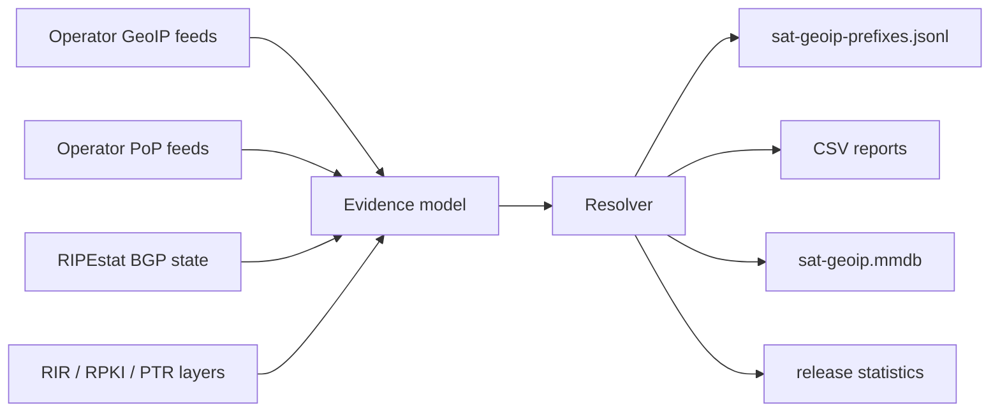

_English version: [README.md](README.md)_

# sat-geoip


<p align="center">
  <a href="./LICENSE"></a>
  <a href="https://github.com/ipanalytics/Sat-geoip/actions/workflows/dataset-release.yml"></a>
  <a href="https://github.com/ipanalytics/Sat-geoip/releases"></a>
  
  
</p>

sat-geoip формирует аналитический набор данных о спутниковом интернете на основе GeoIP-фидов операторов, сопоставлений подсетей с PoP, актуальных BGP-анонсов, свидетельств владения из RIR/RPKI и исторических снимков. Он генерирует артефакты в форматах CSV, JSONL и MaxMind DB, в которых геолокация, привязка к PoP, PTR-наблюдения и состояние маршрутизации хранятся как отдельные слои свидетельств (evidence).

---

## Ссылки

| Ресурс | Расположение |
|---|---|
| Интерактивный дашборд | [GitHub Pages](https://ipanalytics.github.io/Sat-geoip/) |
| Последний релиз набора данных | [GitHub Releases](https://github.com/ipanalytics/Sat-geoip/releases) |
| Сгенерированные артефакты | [`outputs/`](./outputs) |
| Реестр операторов | [`config/operators.yaml`](./config/operators.yaml) |
| Пример свидетельств | [`examples/acceptance_evidence.json`](./examples/acceptance_evidence.json) |

## Обзор

Спутниковые сети не вписываются напрямую в стандартные допущения GeoIP. Клиентская подсеть, заявленный PoP, подсказка из обратного DNS и BGP origin — это разные факты с разными режимами отказов. sat-geoip сохраняет эти факты в отдельных полях и фиксирует сигналы качества, которые связывают их между собой или противоречат им.

Конвейер ориентирован на рабочие процессы инженерии данных и инфраструктуры:

- принимать опубликованные операторами geofeed-данные и карты PoP;
- сопоставлять их с актуальным состоянием origin в BGP;
- сохранять явную семантику для каждого производного поля;
- генерировать стабильные машиночитаемые артефакты для обогащения данных, аналитики маршрутизации и инвентаризации инфраструктуры.

## Архитектура



Резолвер применяет фиксированные правила приоритета:

| Поле | Приоритетный источник | Примечания |
|---|---|---|
| Оператор | актуальный BGP origin, затем совпадение организации в RIR | ASN рассматриваются как обнаруженное множество |
| GeoIP | geofeed оператора | семантика местоположения клиентской подсети |
| PoP | официальный фид PoP | PTR служит только подтверждением |
| Состояние маршрутизации | BGP-коллекторы | geofeed-данные не подразумевают актуальную маршрутизацию |
| Заявление о наземной станции | константа `false` | никогда не выводится из данных GeoIP или PoP |

## Текущий набор данных

<!-- SAT_GEOIP_STATS_START -->
| Метрика набора данных | Количество |
|---|---:|
| Префиксы | 15285 |
| Анонсируемые префиксы | 11399 |
| Префиксы только из GeoFeed | 3886 |
| Префиксы только из BGP | 10343 |
| Префиксы с привязкой к PoP | 3906 |
| Заявления о наземных станциях | 0 |

### Операторы

| Имя | Количество |
|---|---:|
| `anuvu` | 69 |
| `avanti` | 23 |
| `bentley_walker` | 33 |
| `caprock` | 3 |
| `carnival` | 1 |
| `castor_marine` | 4 |
| `china_satcom` | 84 |
| `esa` | 81 |
| `eutelsat_skylogic` | 271 |
| `gazprom_space_systems` | 49 |
| `gilat_telecom` | 225 |
| `gogo_business_aviation` | 1 |
| `hispasat` | 40 |
| `hughes` | 672 |
| `inmarsat` | 55 |
| `intelsat` | 96 |
| `intelsat_general` | 3 |
| `iridium` | 11 |
| `itc_global` | 8 |
| `kacific` | 26 |
| `kt_sat` | 4 |
| `kuiper` | 2 |
| `kvh` | 61 |
| `marlink` | 30 |
| `nasa_jpl` | 15 |
| `navarino` | 11 |
| `nbn_sky_muster` | 459 |
| `nsslglobal` | 1 |
| `omniaccess` | 13 |
| `oneweb` | 19 |
| `panasonic_avionics` | 14 |
| `rignet` | 1 |
| `rocket_lab` | 2 |
| `royal_caribbean` | 1 |
| `rscc` | 30 |
| `satcom_direct` | 4 |
| `ses_o3b` | 21 |
| `sky_perfect_jsat` | 6 |
| `spacex_infrastructure` | 1 |
| `speedcast` | 108 |
| `starlink` | 6549 |
| `swarm` | 1 |
| `tampnet` | 6 |
| `telesat` | 44 |
| `telespazio` | 13 |
| `thales_avionics` | 1 |
| `thuraya` | 10 |
| `turksat` | 973 |
| `usap` | 19 |
| `viasat` | 5016 |
| `yahsat` | 95 |

### Классы орбит

| Имя | Количество |
|---|---:|
| `deep_space` | 15 |
| `geo` | 2744 |
| `geo_mss` | 29 |
| `geo_or_hybrid_satellite` | 5389 |
| `geo_or_multi_orbit` | 96 |
| `hybrid_satellite_offshore` | 6 |
| `leo` | 6585 |
| `meo` | 21 |
| `mixed_satellite` | 400 |
<!-- SAT_GEOIP_STATS_END -->

Каталог `outputs/`, включённый в репозиторий, генерируется из актуальных публичных фидов. Фикстура с примером свидетельств остаётся в репозитории для отработки приёмочных сценариев и детерминированных тестов.

## Покрытие операторов

Текущий реестр охватывает сети LEO, MEO, GEO, мобильные, морские, авиационные, исследовательские, сети космических агентств и пусковой инфраструктуры. Полный машиночитаемый список ASN формируется в [`outputs/satellite-asns.csv`](./outputs/satellite-asns.csv); поддерживаемый реестр находится в [`config/operators.yaml`](./config/operators.yaml).

| Класс охвата | Примеры | Слои подтверждений (evidence) | GeoFeed |
|---|---|---|---|
| LEO / MEO спутниковый интернет | Starlink, OneWeb, Iridium, Amazon Leo / Kuiper, SES/O3b | GeoIP/PoP, где опубликованы; BGP, модель RDAP/RPKI | Starlink активен |
| GEO / гибридный спутниковый интернет | Viasat, Hughes, Inmarsat, Telesat, Yahsat, Hispasat, Kacific, Thaicom, Turksat, China Satcom, KT Sat | GeoIP, где опубликован; BGP, модель RDAP/RPKI | Viasat активен |
| Морские, авиационные и удалённые поставщики услуг | Marlink, Speedcast, KVH, Anuvu, Panasonic Avionics, Satcom Direct, Gogo, NSSLGlobal, OmniAccess, Castor Marine, Navarino, Tampnet | BGP, модель RDAP/RPKI | Anuvu/MTNSAT активен |
| Региональные операторы VSAT и телепортов | Avanti, Eutelsat/Skylogic, Telespazio, Sky Perfect JSAT, RSCC, Gazprom Space Systems, Gilat Telecom, APSTAR, NBN Sky Muster | BGP, модель RDAP/RPKI | не найдено |
| Космическая и исследовательская инфраструктура | Swarm, инфраструктура SpaceX, KSAT, USAP, NASA JPL, ESA, CNES, Rocket Lab | BGP, модель RDAP/RPKI | не найдено |
| Сети мобильности и круизных линий | Carnival, Royal Caribbean, Thales Avionics, Lufthansa Systems, RigNet, CapRock, ITC Global | BGP, модель RDAP/RPKI | не найдено |

## Возможности

- Resolver на Go с типизированными подтверждениями и каноническими записями разрешённых префиксов (resolved-prefix).
- Реестр операторов, охватывающий ASN операторов спутникового интернета, поставщиков MSS, интеграторов мобильной связи, сетей круизных линий, исследовательских сетей и космической инфраструктуры.
- Парсер geofeed по RFC 8805 и парсер CSV-файлов PoP Starlink.
- Парсер анонсированных префиксов RIPEstat для актуального состояния BGP.
- Вывод в форматах CSV, JSONL и MaxMind DB.
- Статистика релиза в JSON и Markdown.
- Статический дашборд на GitHub Pages, генерируемый из выходных данных релиза.
- Workflow GitHub Actions для сборки набора данных по расписанию и публикации релизов.
- Тесты для приёмочных сценариев, защищающие семантику полей и разделение уровней уверенности (confidence).

## Быстрый старт

```sh
git clone https://github.com/ipanalytics/Sat-geoip.git
cd Sat-geoip
go test ./...
go run ./cmd/sat-geoip -format release -evidence examples/acceptance_evidence.json -out outputs
```

Сборка из публичных источников в реальном времени:

```sh
go run ./cmd/sat-geoip -format live-release -out outputs
```

## Установка

sat-geoip — стандартный модуль Go.

```sh
go install ./cmd/sat-geoip
```

Для воспроизводимых сборок в CI используйте Go 1.24 или новее.

## Использование

Сгенерировать разрешённые записи из файла подтверждений:

```sh
go run ./cmd/sat-geoip \
  -format jsonl \
  -evidence examples/acceptance_evidence.json
```

Сгенерировать все артефакты релиза:

```sh
go run ./cmd/sat-geoip \
  -format release \
  -evidence examples/acceptance_evidence.json \
  -out outputs
```

Сгенерировать все артефакты из публичных каналов данных в реальном времени:

```sh
go run ./cmd/sat-geoip \
  -format live-release \
  -out outputs
```

Обновить блок статистики в README на основе статистики релиза:

```sh
go run ./cmd/sat-geoip \
  -format update-readme-stats \
  -stats outputs/stats.json \
  -readme README.md
```

## Артефакты

| Файл | Описание |
|---|---|
| `sat-geoip-prefixes.jsonl` | Канонические разрешённые записи, один префикс на строку |
| `sat-geoip-prefixes.csv` | Плоская таблица разрешённых префиксов |
| `sat-geoip.mmdb` | MaxMind DB для поиска по префиксам |
| `satellite-asns.csv` | Исходный (seed) реестр ASN операторов |
| `operator-geofeeds.csv` | Известные URL каналов данных операторов и их форматы |
| `operator-gateway-reference.csv` | Справочные метаданные стран для шлюзов; не клиентский GeoIP |
| `prefix-changes.jsonl` | События изменений по каждому префиксу в сравнении с предыдущим закоммиченным выходным набором |
| `prefix-changes.csv` | Плоская таблица событий изменений |
| `history-summary.json` | Счётчики истории на уровне релиза |
| `starlink-geoip-vs-bgp.csv` | Сравнение geofeed и BGP для Starlink |
| `starlink-pop-mapping.csv` | Соответствие префиксов Starlink и PoP |
| `pops-vs-ptr-mismatch.csv` | Отчёт о расхождениях PTR/PoP |
| `stats.json` | Машиночитаемая статистика релиза |
| `RELEASE_NOTES.md` | Markdown-содержимое для GitHub Releases |

## Формат данных

Канонические записи JSONL соответствуют схеме resolved-prefix:

```json
{
  "prefix": "14.1.64.0/24",
  "operator": "starlink",
  "operator_group": "spacex",
  "service_type": "satellite_internet",
  "orbit_class": "leo",
  "origin_asn": 45700,
  "origin_as_name": "IDNIC-STARLINK-AS-ID",
  "geoip_country": "PH",
  "geoip_city": "Manila",
  "geoip_source": "starlink_feed_csv",
  "geoip_semantics": "customer_subnet_geoip_location",
  "pop_code": "mnlaphl1",
  "pop_iata": "mnl",
  "pop_source": "starlink_pops_csv",
  "bgp_state": "announced",
  "ground_station_claim": false,
  "active_user_claim": true,
  "quality_flags": ["geoip_valid", "bgp_announced", "origin_asn_expected"],
  "data_confidence": {
    "attribution": 0.997,
    "geo": 0.85
  }
}
```

`data_confidence.attribution` и `data_confidence.geo` намеренно разделены. Атрибуция отвечает на вопрос, принадлежит ли префикс набору оператора. Гео-достоверность отвечает на вопрос, является ли заявленная метка местоположения внутренне согласованной.

## Референсные данные для валидации

Конвейер включает локальные референсные наборы данных в [`data/reference`](./data/reference):

| Источник | Назначение |
|---|---|
| GeoNames `countryInfo`, `admin1CodesASCII`, `cities1000` | валидация страны, субъекта и пары город-страна |
| OurAirports `airports.csv` | валидация соответствия кодов аэропортов IATA странам |

Эти файлы — референсы для валидации, а не источники GeoIP. Они улучшают флаги качества, такие как `geoip_invalid_country_city_pair`, и поддерживают проверки корректности PoP/gateway, не переопределяя семантику geofeed, опубликованных операторами.

## Эксплуатационные примечания

- Плановые релизы запускаются из GitHub Actions и публикуют релиз набора данных с тегом даты.
- Живые сборки получают публичные фиды операторов и ответы RIPEstat Data API.
- Задачи релиза обновляют `README.md`, `outputs/` и тело GitHub Release статистикой набора данных.
- `first_seen`, `last_seen`, `changed_at` и `change_type` — поля истории снапшотов репозитория. Они описывают, когда sat-geoip впервые наблюдал или изменил запись, а не когда оператор изначально выделил или маршрутизировал префикс.
- Отчёты об изменениях префиксов сравнивают текущую сборку с ранее закоммиченным артефактом `sat-geoip-prefixes.jsonl`.
- Хранение сырых снапшотов входит в долгосрочную дорожную карту; текущие закоммиченные выходные данные представляют последний сгенерированный набор релизных артефактов.
- Резолвер архитектурно разделяет слои доказательств. Потребители должны выбирать поле, соответствующее их рабочему процессу, вместо свёртывания полей в единое местоположение.

## Варианты использования

- обогащение префиксов спутниковых ISP в системах инвентаризации сети;
- сравнение заявленных оператором GeoIP-данных с живыми BGP-анонсами;
- отслеживание изменений привязки PoP у Starlink;
- генерация MMDB-файлов обогащения для edge- и аналитических конвейеров;
- аудит согласованности фидов на уровнях страны, города, PoP и origin-AS.

## Область охвата

sat-geoip охватывает data engineering для спутникового интернета: фиды операторов, состояние BGP, доказательства владения, привязки PoP, релизные артефакты и отслеживание исторических изменений. Он не оценивает пользователей, репутацию, злоупотребления, анонимность или риски.

## Ограничения

- Живой сбор BGP в настоящее время использует REST API RIPEstat, а не потоки MRT/RIS-Live.
- Обогащение PTR и RPKI представлено в модели, но не полностью собирается в конвейере первого релиза.
- OneWeb/Eutelsat и большинство операторов, кроме Starlink/Viasat, получают данные на основе BGP, пока не будут найдены публичные geofeed операторов.
- SES/O3b, Hughes, Marlink, Intelsat, Avanti, Speedcast, Inmarsat и Thuraya в первом релизе получают данные на основе BGP, поскольку публичный geofeed RFC 8805 для этих операторов неизвестен.

## Структура каталогов

```text
.
├── cmd/sat-geoip/              # CLI entry point
├── config/                    # operator registry
├── data/reference/            # validation-only GeoNames and OurAirports datasets
├── examples/                  # acceptance evidence fixtures
├── internal/collectors/       # feed and BGP collector helpers
├── internal/export/           # CSV and JSONL writers
├── internal/history/          # per-prefix snapshot history and change reports
├── internal/live/             # live public-source dataset builder
├── internal/mmdb/             # MaxMind DB writer
├── internal/release/          # artifact and statistics generation
├── internal/resolver/         # core evidence resolution engine
├── internal/validators/       # RFC 8805 and PoP parsers
├── outputs/                   # generated dataset artifacts
└── site/                      # README assets
```

## Развёртывание

Репозиторий включает плановый workflow GitHub Actions:

```text
.github/workflows/dataset-release.yml
```

Он запускает тесты, собирает живые релизные артефакты, обновляет статистику README, коммитит сгенерированные файлы и публикует GitHub Release с файлами набора данных.

Ручной релиз:

```sh
gh workflow run dataset-release.yml
```

## Лицензия

sat-geoip распространяется по лицензии [Apache License 2.0](./LICENSE).

## Отказ от ответственности

sat-geoip публикует производные данные об инфраструктуре из публичных источников. Фиды операторов и публичные BGP API могут быть неполными, запаздывать или быть внутренне несогласованными; downstream-системы должны сохранять исходную семантику, включённую в каждую запись.
